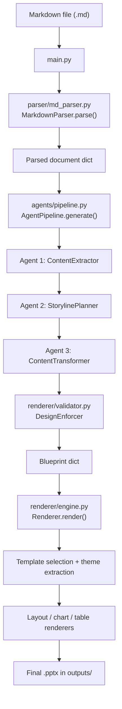

# Genesis

Genesis is a Markdown-to-PowerPoint pipeline that turns long-form research documents into polished `.pptx` decks.

The project is built around one active flow:

1. Parse a research-heavy Markdown file into structured content.
2. Transform that structure into a slide blueprint with a multi-agent content pipeline.
3. Render the blueprint into a PowerPoint deck using real PowerPoint templates, native charts, native tables, and programmatic layouts.

The code is designed to degrade gracefully. If the Groq-backed LLM path is unavailable, the project still produces a deck by falling back to deterministic Python heuristics.

## What the project is trying to do

This is not a 1:1 Markdown renderer. The goal is to take a dense report and turn it into something that looks like a presentation a human would have designed:

- fewer slides than sections in the report
- a narrative arc instead of raw document order
- charts only when numeric data exists
- tables only when tabular data survives better than a chart
- different visual layouts depending on content density
- output shaped by PowerPoint templates rather than hardcoded colors alone

In short: the parser extracts facts, the agent layer decides story + structure, and the renderer decides how to draw that structure into a `.pptx`.

## Current runtime flow

The active code path starts in [`main.py`](./main.py), not in the older `storyline/` package.



## Why the project is split this way

The separation of concerns is the main architectural idea in this repo.

- `parser/` is deterministic and structural. It answers: "What is in the Markdown file?"
- `agents/` is semantic. It answers: "What matters, what should become a slide, and how should the deck flow?"
- `renderer/` is visual and layout-focused. It answers: "How do we draw the approved blueprint into PowerPoint?"
- `validator.py` sits between the agent layer and renderer because presentation constraints like word-count limits and layout variety are better enforced in Python than by prompt text alone.

That split matters because each stage solves a different problem:

- parsing is about correctness
- planning is about judgment
- rendering is about geometry
- validation is about safety rails

## Stage-by-stage breakdown

### 1. CLI entry point - `main.py`

`main.py` is the orchestration layer. It:

- parses CLI arguments
- validates input/output/template paths
- enforces `--slides` to the 10-15 range
- runs the three major stages in order
- logs progress and exits cleanly on failure

Supported CLI arguments:

- `--md` (required): input Markdown file
- `--output` (required): output `.pptx` path
- `--slides` (optional): target slide count, must be between 10 and 15
- `--template` (optional): explicit PowerPoint template
- `--templates-dir` (optional): directory for template auto-selection, defaults to `templates`
- `--debug` (optional): enables verbose logging

### 2. Stage 1 - Markdown parsing (`parser/md_parser.py`)

`MarkdownParser` uses Mistune's AST renderer plus the table plugin. It does a single-pass walk over the Markdown token stream and builds a normalized document dictionary.

What it extracts:

- document title from the first H1, or filename fallback
- subtitle from early top-matter if present
- executive summary from any H2 containing "executive summary"
- H2 sections
- H3 subsections
- bullets
- paragraphs
- Markdown tables
- numerical patterns that can later drive charts

Important parser behaviors:

- reads files in chunks and caps parsing at 5 MB
- skips code blocks, HTML blocks, blank lines, and thematic breaks
- skips "Table of Contents", "References", "Bibliography", and "Appendix" H2 sections
- flattens deeper headings into subsection content
- preserves link text / image alt text but drops URLs
- converts numeric text into simple `numerical_data` structures when possible

The parser's output is intentionally richer than a plain outline, but still raw enough that the next stage can make presentation-specific decisions.

Typical parser output shape:

```json
{
  "title": "Report title",
  "subtitle": "Optional subtitle",
  "executive_summary": "Paragraph text",
  "sections": [
    {
      "heading": "Section heading",
      "level": 2,
      "content": "Section intro text",
      "subsections": [
        {
          "heading": "Subsection heading",
          "level": 3,
          "bullets": ["..."],
          "paragraphs": ["..."],
          "tables": [{"headers": ["..."], "rows": [["..."]]}],
          "has_numerical_data": true,
          "numerical_data": [{"context": "Revenue", "values": {"2023": 10, "2024": 15}}]
        }
      ]
    }
  ],
  "total_sections": 8,
  "total_tables": 2,
  "total_numerical_blocks": 4
}
```

### 3. Stage 2 - Multi-agent intelligence (`agents/`)

The current system does **not** use one monolithic storyline prompt anymore. It now uses three narrower agents coordinated by `agents/pipeline.py`.

#### `agents/base_agent.py`

This is shared infrastructure for all agents. It provides:

- `.env` loading
- Groq client initialization
- round-robin API key pooling across `GROQ_API_KEY` and `GROQ_API_KEY_1` through `GROQ_API_KEY_10`
- a common `_call_llm()` method
- resilient JSON extraction from imperfect model output
- retry logic for malformed or partial responses

This file exists so all agent-specific files can focus on their own task instead of repeating API + JSON handling.

#### Agent 1 - `ContentExtractor`

`agents/content_extractor.py`

Purpose:

- compress the raw parsed document into a presentation-oriented content summary
- find the most useful insights per section
- identify chart/table/process/comparison opportunities
- extract global stats for KPI slides
- estimate a sensible slide count

It can run in two modes:

- single prompt for smaller inputs
- chunked extraction for large inputs

Chunked mode exists because the repo is tuned around Groq token-budget constraints. In chunked mode it does:

1. one overview call for title, subtitle, executive summary, and stats
2. one call per H2 section
3. a merge pass into `extracted_content`

Fallback behavior:

- if the LLM path fails, it uses rule-based extraction from bullets, sentences, tables, and numeric blocks

Output shape:

```json
{
  "title": "Presentation title",
  "subtitle": "Short subtitle",
  "executive_summary_bullets": ["..."],
  "key_sections": [
    {
      "heading": "Section name",
      "key_insights": ["..."],
      "visual_type": "chart|table|timeline|process_flow|comparison|none",
      "chart_data": {},
      "table_data": {},
      "process_steps": [],
      "comparison": {}
    }
  ],
  "global_stats": [{"value": "$6.6B", "label": "FY24 investment"}],
  "suggested_slide_count": 12
}
```

#### Agent 2 - `StorylinePlanner`

`agents/storyline_planner.py`

Purpose:

- decide the slide sequence
- assign slide types
- assign layouts
- keep the total deck within 10-15 slides

This agent does **not** write slide content. It only plans the structure.

That is important because it narrows the model's task from "write the whole deck" to "decide the best deck skeleton".

It knows about:

- mandatory cover / agenda / conclusion / thank-you patterns
- executive summary slides
- chart and table slides
- section divider placement
- layout rotation rules
- which layouts fit dense vs sparse sections

Fallback behavior:

- if planning fails, it builds a rule-based slide plan by walking sections and choosing layouts from heuristics

Output shape:

```json
{
  "total_slides": 12,
  "slides": [
    {"slide_number": 1, "type": "cover"},
    {"slide_number": 2, "type": "executive_summary", "layout": "exec_summary_with_photo"},
    {"slide_number": 3, "type": "agenda"},
    {"slide_number": 4, "type": "section_divider", "source_section": "Section A"},
    {"slide_number": 5, "type": "content", "layout": "two_col_sidebar", "source_section": "Section A"}
  ]
}
```

#### Agent 3 - `ContentTransformer`

`agents/content_transformer.py`

Purpose:

- take the slide plan and fill every slide with concrete content fields
- map sections to content blocks
- build chart payloads, table payloads, card arrays, side-by-side columns, timelines, and conclusions

Again, this agent is narrower than the old one-shot generator. It does not decide slide order anymore; it only fills the plan.

It can run in:

- one large call for compact decks
- batched calls for larger prompts

The code first builds a per-slide context list, so every slide is paired with its source section and any structured data it may need.

Fallback behavior:

- if the LLM path fails, `_rule_based_transform()` creates a valid blueprint entirely in Python

#### Validator - `renderer/validator.py`

This is technically in `renderer/`, but logically it finishes Stage 2.

Purpose:

- normalize and repair the blueprint before any drawing happens

What it enforces:

- first slide is cover
- last slide is thank-you
- titles are non-empty
- cover subtitle length is capped
- bullets and descriptions are truncated to safer lengths
- empty arrays get placeholder content
- `three_cards` has exactly 3 cards
- `key_stats` has 2-4 stats
- slide numbers are renumbered sequentially
- `total_slides` is corrected
- consecutive content slides do not reuse the same layout
- two heavy layouts do not appear back-to-back

This file exists because visual overflow and layout rhythm are much easier to enforce with code than with prompts.

### 4. Stage 3 - Rendering (`renderer/`)

This is where the blueprint becomes an actual `.pptx`.

#### `renderer/engine.py`

`Renderer.render()` is the stage entry point.

It:

1. chooses a template
2. opens it as a `python-pptx` `Presentation`
3. extracts theme colors from the template's master/theme XML
4. mutates `config.py` color globals so downstream renderers use the template palette
5. iterates over the blueprint slides
6. dispatches each slide to the correct renderer
7. removes the original placeholder/template slides
8. saves the final output

Template selection logic:

- if `--template` is passed, use it directly
- otherwise profile every `.pptx` in `templates/`
- score templates heuristically by document keywords and template color "mood"
- if the best two scores are close, optionally use the LLM as a tiebreaker

This is a nice detail in the project: the deck's visual identity is intentionally template-driven, not only content-driven.

#### `renderer/utils.py`

Low-level helper layer shared by all renderers:

- find slide layouts by name
- get a blank layout
- add styled text boxes
- add bulleted text boxes
- style shapes with fills, borders, and rounded corners
- add slide numbers
- add standard slide titles
- remove original template slides via XML

#### `renderer/layouts.py`

This is the main content-slide drawing module. It dispatches by `layout`.

Supported layouts:

- `agenda`
- `two_column`
- `two_col_sidebar`
- `three_cards`
- `six_cards`
- `five_cards_row`
- `key_stats`
- `timeline`
- `process_flow`
- `comparison`
- `icon_list`
- `single_focus`
- `exec_summary_with_photo`

Design language used repeatedly:

- serif slide titles and headings
- red accent bars / stripes
- cream cards with red borders
- icon glyphs derived heuristically from content keywords
- red sidebars or full-bleed red backgrounds for hero slides

The code is more of a drawing engine than a theme wrapper: most slides are laid out with explicit geometry.

#### `renderer/visuals.py`

Reusable presentation motifs:

- full-height red sidebar
- red top pill title bar
- full-slide red background
- numbered badge circles
- cards with heading divider
- icon glyph mapping from text keywords to built-in PowerPoint shapes

This file exists so the layout module can compose high-level visuals instead of redrawing the same decoration patterns everywhere.

#### `renderer/charts.py`

Builds **native Office charts** with `python-pptx`.

Supported chart types:

- bar
- horizontal bar
- pie
- line
- area

Nice implementation details:

- horizontal bars are chosen automatically when labels are more text-heavy
- series values are coerced to numeric safely
- theme colors come from `config.CHART_COLORS`
- output stays editable in PowerPoint because charts are not raster images

#### `renderer/tables.py`

Builds styled PowerPoint tables.

Key behavior:

- theme-colored header row
- alternating row backgrounds
- first column styled as a row label
- direct XML manipulation to remove inherited table styles and apply cell fills

This XML-level work is necessary because `python-pptx` alone is limited for detailed table styling.

#### `renderer/infographics.py`

Shape-based helpers for more complex diagram styles:

- vertical timeline
- wrapped process flow
- comparison grid

These are not the main dispatcher, but they are support pieces for richer infographic-like slides.

## Core data handoffs

The project passes through four main internal representations:

1. `parsed`
   - raw structural understanding of the Markdown document

2. `extracted_content`
   - content distilled into presentation-friendly insights and visual opportunities

3. `slide_plan`
   - slide sequence, types, and layout assignments

4. `blueprint`
   - final renderer-ready slide payload

That pipeline is the heart of the project:

`Markdown -> parsed -> extracted_content -> slide_plan -> blueprint -> .pptx`

## Repository structure

This is the practical repo map as it exists today:

```text
Genesis/
|- main.py                     # CLI entry point and stage orchestrator
|- config.py                   # Global slide dimensions, colors, fonts, spacing
|- restyle.py                  # Separate one-off post-processing script for a specific deck
|- CLAUDE.md                   # Older project notes; useful context but not fully up to date
|- parser/
|  |- __init__.py
|  \- md_parser.py             # Markdown -> parsed dict
|- agents/
|  |- __init__.py
|  |- base_agent.py            # Groq client pooling, retries, JSON parsing
|  |- content_extractor.py     # Agent 1
|  |- storyline_planner.py     # Agent 2
|  |- content_transformer.py   # Agent 3
|  \- pipeline.py              # Active Stage 2 orchestrator
|- storyline/
|  |- __init__.py
|  |- generator.py             # Legacy single-agent generator
|  \- prompts.py               # Legacy prompt builders
|- renderer/
|  |- __init__.py
|  |- engine.py                # Active Stage 3 entry point
|  |- validator.py             # Blueprint repair / enforcement
|  |- layouts.py               # Content layout renderers
|  |- visuals.py               # Reusable visual primitives
|  |- charts.py                # Native Office chart rendering
|  |- tables.py                # Styled table rendering
|  |- infographics.py          # Complex shape-based visual helpers
|  \- utils.py                 # Shared low-level rendering utilities
|- templates/                  # PowerPoint master templates used by Renderer
|- test_cases/                 # Example Markdown inputs
|- outputs/                    # Generated decks
|- target/                     # Reference design assets, not part of runtime flow
\- env/                        # Local virtual environment (ignored by git)
```

## Inputs and outputs

### Inputs

Primary runtime inputs:

- one `.md` file
- one explicit `.pptx` template, or a templates directory for auto-selection

Example Markdown sources already in the repo:

- `test_cases/accenture.md`
- `test_cases/AI_Bubble.md`
- `test_cases/UAE.md`

Available templates already in the repo:

- `templates/master_template_1.pptx`
- `templates/master_template_2.pptx`
- `templates/master_template_3.pptx`

### Output

- one generated `.pptx` in `outputs/`

The renderer appends newly created slides to the chosen template, then removes the original template/demo slides so only the generated deck remains.

## Setup

There is no committed `requirements.txt` in the repo right now, so installation is best inferred from the imports.

Minimum direct dependencies used by the code:

- `python-pptx`
- `groq`
- `python-dotenv`
- `mistune`
- `lxml`

The checked-in virtual environment was created with Python 3.14 (`env/pyvenv.cfg` shows `3.14.3`).

Example setup in PowerShell:

```powershell
python -m venv env
.\env\Scripts\Activate.ps1
pip install python-pptx groq python-dotenv mistune lxml
```

Environment variables expected by the active agent pipeline:

```env
GROQ_API_KEY=...
GROQ_API_KEY_1=...
GROQ_API_KEY_2=...
```

Only `GROQ_API_KEY` is necessary. The numbered variants are optional and are used for round-robin rate-limit spreading.

## Running the project

Basic run:

```powershell
python main.py --md test_cases\UAE.md --output outputs\uae_demo.pptx
```

With explicit slide count:

```powershell
python main.py --md test_cases\accenture.md --output outputs\accenture_demo.pptx --slides 12
```

With explicit template:

```powershell
python main.py --md test_cases\AI_Bubble.md --template templates\master_template_2.pptx --output outputs\ai_bubble_demo.pptx
```

With debug logging:

```powershell
python main.py --md test_cases\UAE.md --output outputs\uae_debug.pptx --debug
```

## What happens when no API key is available

This is one of the strongest parts of the design.

If Groq is unavailable:

- `ContentExtractor` uses rule-based extraction
- `StorylinePlanner` uses rule-based planning
- `ContentTransformer` uses rule-based slide generation
- `DesignEnforcer` still normalizes the blueprint
- `Renderer` still produces a `.pptx`

So the project can still run end-to-end without LLM access. The deck may be less nuanced, but the pipeline is still operational.

## Non-runtime / legacy / reference pieces

### `storyline/`

`storyline/generator.py` and `storyline/prompts.py` represent the older single-agent architecture.

They are no longer the primary runtime path. The active path is:

- `main.py`
- `agents/pipeline.py`
- `renderer/engine.py`

There is still a `_legacy_generate()` helper inside `agents/pipeline.py`, but in the current code it is **defined and never called**.

### `restyle.py`

`restyle.py` is not part of `main.py` or the active pipeline.

It is a separate, deck-specific script that:

- opens `outputs/new3.pptx`
- applies slide-by-slide manual restyling
- writes `outputs/output_styled.pptx`

It is best understood as an experimental or one-off styling utility used to mimic a target design, not as part of the standard Markdown-to-PPTX flow.

### `target/`

The `target/` directory contains reference assets:

- `target.pdf`
- `Common_Mistakes_and_overall_guide_to_improve_slides.pptx`

These are not imported anywhere in the runtime code. They appear to be design references for manual guidance.

## Practical caveats and repo realities

These are worth knowing before extending the project:

1. **Code is a more reliable source of truth than `CLAUDE.md`.**
   `CLAUDE.md` still describes the older Stage 2 architecture and mentions files like `requirements.txt` that are not present.

2. **Some prompt builders still mention `key_terms`, but the parser does not currently emit that field.**
   The agent code checks for it defensively, but it is not part of the parser's real schema today.

3. **Renderer modules mutate shared color globals at runtime.**
   `engine.py` reads the template's theme and overwrites values in `config.py` so charts, cards, tables, and accents all follow the selected template palette.

4. **A single bad slide should not kill the whole presentation.**
   The renderer wraps per-slide work in `try/except`, logs a warning, and continues.

5. **The project is strongly template-driven.**
   Visual quality depends heavily on the templates in `templates/`, not just on the blueprint.

## Suggested extension points

If you want to improve the project, these are the cleanest places to do it:

- improve numeric extraction in `parser/md_parser.py`
- refine `visual_type` heuristics in `ContentExtractor`
- add new layout types in `renderer/layouts.py`
- add new visual primitives in `renderer/visuals.py`
- improve template scoring in `renderer/engine.py`
- add a real dependency lockfile / `requirements.txt`
- connect the currently unused legacy fallback more explicitly, or remove it

## Quick mental model

If you need the shortest accurate explanation of the codebase:

- `main.py` runs the pipeline
- `parser/` turns Markdown into structured facts
- `agents/` turn those facts into a presentation blueprint
- `validator.py` makes the blueprint safe to render
- `renderer/` turns the blueprint into a real PowerPoint deck
- `storyline/` is older architecture still kept in the repo
- `restyle.py` is a separate manual post-processing experiment

That is the real flow of the project today.
